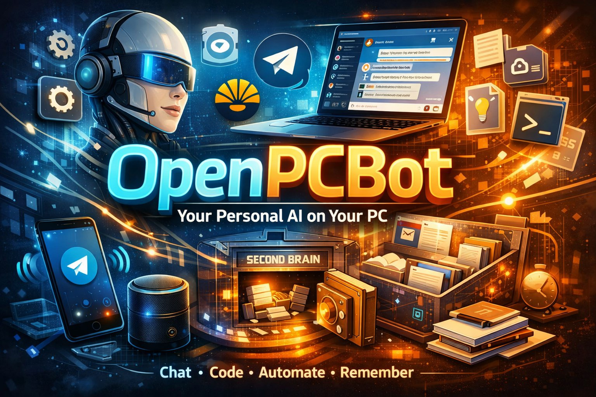

# OpenPCBot



Bot Telegram pessoal rodando Claude Code CLI na maquina local, com sistema multi-agente (Ollama, Codex, OpenRouter), orquestrador inteligente, e segundo cerebro (vault de notas).

Baseado no [ClaudeClaw](https://github.com/earlyaidopters/claudeclaw). Guia completo do upstream em [CLAUDECLAW_GUIDE.md](./CLAUDECLAW_GUIDE.md).

---

## O que e

OpenPCBot e um assistente pessoal via Telegram que roda o `claude` CLI real na sua maquina. Nao e wrapper de API. Ele spawna o processo Claude Code com todas as suas skills, tools e contexto, e devolve o resultado no Telegram.

Alem do Claude, integra Ollama (local, gratis), OpenRouter (multi-modelo), e Codex (OpenAI) como agentes alternativos, com um orquestrador que classifica e despacha mensagens automaticamente.

Inclui um sistema de "segundo cerebro" que armazena notas, documentos e contexto num vault local, permitindo que o bot acumule conhecimento sobre voce e seus projetos ao longo do tempo.

---

## Stack

| Componente | Tecnologia |
|------------|-----------|
| Runtime | Node.js 20+ / TypeScript |
| Bot | grammy (Telegram Bot API) |
| Agente principal | Claude Agent SDK (`@anthropic-ai/claude-agent-sdk`) |
| LLM local | Ollama (qwen3.5:35b-a3b / qwen2.5:14b) |
| Multi-modelo | OpenRouter API |
| Coding agent | Codex CLI (OpenAI) |
| Database | SQLite (WAL mode) com FTS5 |
| Dashboard | Hono + Tailwind + Chart.js (porta 3141) |
| Voice STT | Groq Whisper |
| Voice TTS | ElevenLabs / Gradium / macOS say |
| Second Brain | Vault local (.md) + Gemini/Claude/Ollama para processamento |
| Google Workspace | gws CLI (`@googleworkspace/cli`) — Gmail, Calendar, Drive, Docs, Sheets, Tasks, YouTube |
| Servico | systemd user service |

---

## Arquitetura

```
Telegram
  |
  |-- /claude <msg>     -> Claude Agent SDK (tools completas)
  |-- /codex <msg>      -> Codex CLI (full-auto)
  |-- /ollama <msg>     -> Ollama local (gratis)
  |-- /openrouter <msg> -> OpenRouter (multi-modelo)
  |-- /brain <conteudo> -> Salva no vault ~/vault/inbox/
  |-- /daily ou /dia    -> Standup matinal com contexto do vault
  |-- /tldr ou /resuma  -> Salva resumo da sessao no vault
  |
  +-- (sem prefixo)
       |-- "guarda isso: ..."  -> Detecta trigger, salva no vault
       |-- [/orq OFF]          -> Ollama responde direto (default)
       +-- [/orq ON]           -> Orquestrador classifica e despacha
```

O Claude tem acesso completo: bash, file system, web search, MCP servers, skills. Os outros agentes sao mais leves e baratos para tarefas simples.

---

## Funcionalidades

- **Texto, voz, fotos, documentos, videos** via Telegram
- **Sistema multi-agente** com 4 backends (Claude, Ollama, Codex, OpenRouter)
- **Orquestrador** que classifica mensagens e roteia para o agente certo
- **Memoria persistente** com SQLite FTS5, salience decay, e context injection
- **Sessoes persistentes** via Claude Code session resumption
- **Tarefas agendadas** com cron (scheduler interno)
- **Dashboard web** com metricas, memoria, saude, custos, chat em tempo real
- **WhatsApp bridge** via wa-daemon (linked devices, sem API key)
- **Slack integration** com User OAuth Token
- **Envio de arquivos** de volta para o Telegram (PDF, imagens, etc.)
- **Skills auto-loaded** de `~/.claude/skills/`
- **Agentes especialistas** (comms, content, ops, research) com contexto isolado
- **Obsidian auto-injection** de tarefas abertas para agentes
- **Hive mind** para logs cross-agent
- **Project resolver** para navegacao entre projetos locais
- **Second Brain** — vault de notas com comandos /brain, /daily, /tldr e triggers naturais
- **Google Workspace** — Gmail, Calendar, Drive, Docs, Sheets, Tasks, YouTube via gws CLI

---

## Estrutura

```
openpcbot/
├── src/
│   ├── index.ts          Entrypoint
│   ├── bot.ts            Handler Telegram (texto, voz, foto, comandos, brain)
│   ├── agent.ts          Integracao Claude Agent SDK
│   ├── ollama.ts         Cliente Ollama (chat, health, models)
│   ├── openrouter.ts     Cliente OpenRouter API
│   ├── codex.ts          Runner Codex CLI
│   ├── router.ts         Orquestrador (classifica + despacha)
│   ├── db.ts             SQLite (schema, queries, migrations)
│   ├── memory.ts         Memoria (save, search, decay)
│   ├── scheduler.ts      Cron task runner
│   ├── voice.ts          STT (Groq) + TTS (ElevenLabs/Gradium)
│   ├── media.ts          Download de midia do Telegram
│   ├── dashboard.ts      Servidor web dashboard
│   ├── dashboard-html.ts UI do dashboard
│   ├── slack.ts          Cliente Slack API
│   ├── whatsapp.ts       Cliente WhatsApp
│   ├── project-resolver.ts  Resolucao de projetos locais
│   ├── config.ts         Leitor de .env (inclui VAULT_PATH)
│   └── logger.ts         Logger estruturado
├── agents/               Agentes especialistas
│   ├── comms/            Email, Slack, WhatsApp
│   ├── content/          YouTube, LinkedIn, conteudo
│   ├── ops/              Calendario, billing, admin
│   ├── research/         Pesquisa profunda
│   └── _template/        Template para novos agentes
├── skills/               Skills bundled
│   ├── gmail/            Email
│   ├── google-calendar/  Calendario
│   ├── slack/            Slack
│   ├── vault-setup/      Configurador interativo do vault
│   ├── daily/            Standup matinal com contexto do vault
│   ├── tldr/             Resumo de sessao salvo no vault
│   └── file-intel/       Processador de docs (Gemini/Claude/Ollama)
├── scripts/
│   ├── process_files_with_gemini.py   Analisa pasta de arquivos
│   ├── process_docs_to_obsidian.py    Converte docs em notas Obsidian
│   ├── setup.ts          Wizard interativo de setup
│   ├── status.ts         Health check
│   ├── notify.sh         Envia mensagem Telegram via curl
│   ├── wa-daemon.ts      WhatsApp daemon
│   ├── agent-create.sh   Wizard de criacao de agentes
│   └── agent-service.sh  Instala agentes como servico systemd
├── vault-template/       Template de vault (inbox, daily, projects, research, archive)
├── docs/                 Docs de implementacao
├── store/                Runtime (DB, PID, sessoes WhatsApp)
├── workspace/uploads/    Downloads de midia (auto-cleanup 24h)
└── outputs/              Saida do processamento de docs (gitignored)
```

---

## Sistema de Agentes

O OpenPCBot tem 4 agentes LLM integrados, cada um com capacidades diferentes:

### Agentes built-in

| Agente | Comando | Modelo | Capacidades | Custo |
|--------|---------|--------|------------|-------|
| **Ollama** | (default) ou `/ollama` | qwen3.5:35b-a3b | Chat direto, sem tools | Gratis (local) |
| **Claude** | `/claude` | Opus/Sonnet/Haiku | Bash, files, web, MCP, skills — acesso completo | Anthropic Max ou API key |
| **Codex** | `/codex` | GPT (OpenAI) | Coding agent, full-auto | OpenAI API key |
| **OpenRouter** | `/openrouter` | deepseek-chat (configuravel) | Chat multi-modelo | OpenRouter API key |

**Por padrao**, mensagens sem comando vao para o Ollama (gratis, local). Para tarefas que precisam de ferramentas (editar arquivos, rodar comandos, pesquisar web), use `/claude`.

### Como funciona

```
Voce manda mensagem no Telegram
  |
  |-- Tem /comando?
  |     |-- /claude   -> Claude Code (tools completas)
  |     |-- /codex    -> Codex CLI
  |     |-- /ollama   -> Ollama local
  |     |-- /openrouter -> OpenRouter
  |     |-- /brain    -> Salva no vault
  |     +-- /daily, /tldr, etc.
  |
  +-- Sem comando:
        |-- Orquestrador OFF (default):
        |     -> Ollama responde direto (gratis)
        |
        +-- Orquestrador ON (/orq):
              -> Modelo leve classifica a mensagem
              -> "simples" -> responde direto
              -> "precisa tools" -> despacha para Claude/Codex/OpenRouter
```

### Trocar modelos

Cada agente pode ter seu modelo alterado em tempo real:

```
/model sonnet                              — Claude (opus/sonnet/haiku)
/ollama model qwen3.5:35b-a3b             — Ollama (qualquer modelo instalado)
/openrouter model deepseek/deepseek-chat   — OpenRouter (qualquer modelo disponivel)
/models                                    — Mostra modelo ativo de cada agente
```

### Orquestrador

O orquestrador e um roteador automatico. Quando ligado (`/orq`), um modelo leve (qwen2.5:14b) analisa cada mensagem e decide:
- Se e uma pergunta simples -> responde direto (Ollama, gratis)
- Se precisa de ferramentas -> despacha para o Claude ou outro agente

Desligado por padrao. Liga/desliga com `/orq`.

### Agentes especialistas

Alem dos agentes built-in, o OpenPCBot suporta agentes dedicados, cada um com seu proprio bot Telegram, personalidade e contexto isolado:

| Agente | Foco | Modelo default |
|--------|------|----------------|
| **Comms** | Email, Slack, WhatsApp, DMs | Sonnet |
| **Content** | YouTube, LinkedIn, content calendar | Sonnet |
| **Ops** | Calendario, billing, admin, tasks | Sonnet |
| **Research** | Pesquisa web, competitive intel | Sonnet |

Cada agente especialista:
- Tem seu proprio bot Telegram (token separado)
- Roda em processo Node.js independente
- Tem sua propria janela de contexto de 1M tokens
- Tem `CLAUDE.md` personalizado para o papel
- Compartilha o mesmo banco SQLite, skills e `.env`
- Loga acoes na tabela `hive_mind` (visivel por todos os agentes)

```bash
# Criar agente interativamente
npm run agent:create

# Iniciar um agente
npm start -- --agent comms

# Instalar como servico systemd
bash scripts/agent-service.sh install comms
```

### Sessao e historico

```
/newchat              — Limpa sessao Claude, comeca do zero
/respin               — Recarrega ultimas 20 turns apos /newchat
/ollama clear         — Limpa historico Ollama
/openrouter clear     — Limpa historico OpenRouter
```

O Claude mantém sessao persistente entre mensagens (context carry). Ollama e OpenRouter mantém historico em memoria (reseta no restart do bot).

---

## Comandos Telegram

### Agentes

| Comando | Descricao |
|---------|-----------|
| (mensagem normal) | Vai para Ollama (ou orquestrador se /orq ON) |
| `/claude <msg>` | Envia direto para Claude Code (acesso completo a tools) |
| `/ollama <msg>` | Envia para Ollama local |
| `/codex <msg>` | Envia para Codex (OpenAI) |
| `/openrouter <msg>` | Envia para OpenRouter |
| `/orq` | Liga/desliga orquestrador automatico |
| `/models` | Mostra modelo ativo de cada agente |

### Second Brain

| Comando | Descricao |
|---------|-----------|
| `/brain <texto>` | Salva texto como nota no vault (`~/vault/inbox/`) |
| `/brain` (com arquivo) | Envia documento com legenda `/brain` para salvar no vault |
| `/daily` | Standup matinal: le nota do dia, checa inbox, lista prioridades |
| `/dia` | Alias de `/daily` (mesmo comportamento) |
| `/tldr` | Salva resumo da sessao no vault (decisoes, contexto, proximos passos) |
| `/resuma` | Alias de `/tldr` (mesmo comportamento) |
| `/file-intel` | Processa pasta de docs e gera resumos (via Claude skill) |

### Modelos

| Comando | Descricao |
|---------|-----------|
| `/model <nome>` | Troca modelo Claude (opus/sonnet/haiku) |
| `/ollama model <nome>` | Troca modelo Ollama |
| `/openrouter model <nome>` | Troca modelo OpenRouter |
| `/models` | Mostra modelo ativo de cada agente |

### Sessao

| Comando | Descricao |
|---------|-----------|
| `/newchat` | Nova sessao Claude limpa |
| `/respin` | Recupera ultimas 20 turns numa sessao nova |
| `/ollama clear` | Limpa historico Ollama |
| `/openrouter clear` | Limpa historico OpenRouter |

### Monitoramento

| Comando | Descricao |
|---------|-----------|
| `/dashboard` | Link para o dashboard web |
| `/memory` | Mostra memorias recentes |
| `/stop` | Cancela query em execucao |

### Outros

| Comando | Descricao |
|---------|-----------|
| `/voice` | Liga/desliga respostas em audio |
| `/forget` | Limpa sessao (memorias decaem naturalmente) |
| `/wa` | Interface WhatsApp |
| `/slack` | Interface Slack |
| `/help` | Lista todos os comandos |

---

## Second Brain

Sistema de "segundo cerebro" integrado ao bot. Baseado no [second-brain](https://github.com/inematds/second-brain).

Armazena notas, documentos e contexto num vault local (pasta com arquivos `.md`). O Claude le suas notas antes de responder e salva resumos depois de cada sessao. O conhecimento acumula ao longo do tempo.

### O que e o vault

O vault e uma pasta no seu computador (`~/vault/` por padrao) com subpastas organizadas:

```
~/vault/
├── inbox/       Tudo entra aqui primeiro (notas, arquivos, docs)
├── daily/       Notas diarias automaticas (2026-03-17.md)
├── projects/    Uma pasta por projeto ativo
├── research/    Pesquisas e referencias
├── archive/     Coisas finalizadas (nunca deletar, so mover)
└── memory.md    Log de sessoes (atualizado pelo /tldr)
```

Voce nao precisa usar o app Obsidian. Funciona com qualquer editor ou so via bot.

### Setup do vault

```bash
# Criar vault a partir do template
cp -r vault-template/* ~/vault/

# (Opcional) Instalar deps Python para /file-intel
pip install -r requirements.txt

# (Opcional) Copiar skills para Claude Code global
cp -r skills/daily ~/.claude/skills/
cp -r skills/tldr ~/.claude/skills/
cp -r skills/file-intel ~/.claude/skills/
cp -r skills/vault-setup ~/.claude/skills/
```

O `VAULT_PATH` ja vem configurado como `~/vault` no `.env`. Para mudar, edite a variavel.

### Como salvar coisas no brain

Existem 3 formas de salvar conteudo no vault via Telegram:

#### 1. Comando /brain

```
/brain reuniao com cliente dia 20 sobre proposta de consultoria
```

Cria uma nota `.md` em `~/vault/inbox/` com o texto, datada automaticamente.

#### 2. Enviar arquivo com legenda

Envia qualquer arquivo (PDF, Word, planilha, imagem) pelo Telegram com a legenda:
- `/brain`
- "guarda isso"
- "salva no brain"

O arquivo vai direto para `~/vault/inbox/` com o nome original.

#### 3. Linguagem natural (triggers automaticos)

Nao precisa de comando. Escreve normalmente e o bot detecta a intencao:

| Frase | Exemplo |
|-------|---------|
| "guarda isso" | "guarda isso: senha do wifi e XYZ123" |
| "guarda isto" | "guarda isto que o cliente falou sobre prazo" |
| "salva isso" | "salva isso no brain" |
| "salva no brain" | "salva no brain: link do documento final" |
| "salva no cerebro" | "salva no cerebro: framework de precificacao" |
| "armazena isso" | "armazena isso: contato do fornecedor" |
| "memoriza isso" | "memoriza isso: preferencia do cliente por pagamento a vista" |
| "lembra disso" | "lembra disso: deploy programado pra sexta" |
| "manda pro brain" | "manda pro brain: notas da call de hoje" |
| "save this" | "save this: meeting notes from today" |
| "store this" | "store this: API endpoint documentation" |

O bot extrai o conteudo (tudo apos o trigger) e salva como nota em `~/vault/inbox/`.

### Como usar o vault no dia a dia

#### Standup matinal: /daily ou /dia

```
/daily
```

O bot (via Claude):
1. Abre ou cria a nota do dia em `~/vault/daily/2026-03-17.md`
2. Verifica se tem arquivos novos em `~/vault/inbox/`
3. Le o `memory.md` para contexto recente
4. Lista as 3 prioridades do dia
5. Pergunta: "What are we working on today?"

#### Resumo de sessao: /tldr ou /resuma

```
/tldr
```

O bot (via Claude):
1. Resume a conversa atual: decisoes, coisas para lembrar, proximos passos
2. Salva como nota `.md` na pasta mais relevante do vault (projects/, research/, ou daily/)
3. Appende um resumo no `~/vault/memory.md` com a data

O `memory.md` funciona como log acumulativo. Cada `/tldr` adiciona uma entrada. Com o tempo, o Claude pode ler esse arquivo para entender o historico de decisoes.

#### Processar documentos: /file-intel

```
/claude /file-intel
```

Ou pela linha de comando:

```bash
# Processar todos os arquivos de uma pasta
python scripts/process_files_with_gemini.py ~/Documents/contratos

# Converter docs em notas Obsidian direto no inbox
python scripts/process_docs_to_obsidian.py ~/Documents/contratos ~/vault/inbox
```

O processamento usa fallback automatico de LLM:
1. **Gemini** (Google AI Studio, gratis) — default, rapido
2. **Claude CLI** — se Gemini falhar (usa sua conta Claude)
3. **Ollama local** — se ambos falharem (gratis, mais lento)

Formatos suportados: PDF, PPTX, XLSX, DOCX, CSV, JSON, XML, MD, TXT, PY, JS, HTML, CSS, e qualquer arquivo texto.

Para cada arquivo processado, gera:
- `<nome>_summary.md` — resumo individual no formato Obsidian
- `MASTER_SUMMARY.md` — digest completo de todos os arquivos

A saida vai para `outputs/file_summaries/YYYY-MM-DD/`.

### Estrutura de uma nota salva

Quando voce manda `/brain <texto>`, a nota criada tem este formato:

```markdown
---
date: 2026-03-17
source: telegram
---

reuniao com cliente dia 20 sobre proposta de consultoria
```

Quando o `/file-intel` processa um documento, gera resumos mais elaborados com TL;DR, numeros, implicacoes e proximos passos.

### Fluxo completo recomendado

```
1. De manha:     /daily (ou /dia)
                  -> Bot mostra prioridades e o que tem no inbox

2. Durante o dia: Manda coisas pro brain quando surgem
                  -> "guarda isso: decisao X sobre projeto Y"
                  -> Envia PDF com legenda /brain

3. Recebe docs:  /claude /file-intel
                  -> Processa tudo e gera resumos

4. Fim do dia:   /tldr (ou /resuma)
                  -> Salva o que foi feito e decidido
```

---

## Deploy

Roda como systemd user service em `~/.config/systemd/user/openpcbot.service`.

```bash
# Status
systemctl --user status openpcbot

# Logs
journalctl --user -u openpcbot -f

# Restart
systemctl --user restart openpcbot

# Build + restart
npm run build && systemctl --user restart openpcbot
```

---

## Configuracao

Variaveis principais em `.env` (ver `.env.example` para lista completa):

| Variavel | Obrigatoria | Descricao |
|----------|-------------|-----------|
| `TELEGRAM_BOT_TOKEN` | Sim | Token do @BotFather |
| `ALLOWED_CHAT_ID` | Sim | Seu chat ID (envia /chatid) |
| `VAULT_PATH` | Nao | Caminho do vault second brain (default: ~/vault) |
| `GOOGLE_API_KEY` | Nao | Gemini (gratis) para /file-intel e video |
| `OLLAMA_URL` | Nao | URL do Ollama (default: localhost:11434) |
| `OLLAMA_MODEL` | Nao | Modelo para chat direto |
| `OLLAMA_ROUTER_MODEL` | Nao | Modelo para o orquestrador |
| `OPENROUTER_API_KEY` | Nao | Key do OpenRouter |
| `OPENROUTER_MODEL` | Nao | Modelo do OpenRouter |
| `ANTHROPIC_API_KEY` | Nao | Pay-per-token (alternativa ao Max) |
| `GROQ_API_KEY` | Nao | Voice input (Whisper) |
| `ELEVENLABS_API_KEY` | Nao | Voice output |
| `ELEVENLABS_VOICE_ID` | Nao | ID da voz clonada no ElevenLabs |
| `DASHBOARD_TOKEN` | Nao | Token para acesso ao dashboard |
| `SLACK_USER_TOKEN` | Nao | Token Slack (xoxp-) |
| Google Workspace | Nao | Instala `npm i -g @googleworkspace/cli` e roda `gws auth login` |

---

## Guia de Setup por Componente

### Telegram Bot (obrigatorio)

O bot Telegram e o unico requisito. Tudo mais e opcional.

1. Abre o Telegram e busca **@BotFather**
2. Envia `/newbot`
3. Escolhe um nome e username (ex: `MeuBot`, `meu_bot`)
4. Copia o token que o BotFather te da (tipo `1234567890:AAFxxxxxxx`)
5. Cola no `.env`:
   ```
   TELEGRAM_BOT_TOKEN=1234567890:AAFxxxxxxx
   ```
6. Inicia o bot (`npm start`), manda `/chatid` no Telegram
7. Cola o numero no `.env`:
   ```
   ALLOWED_CHAT_ID=123456789
   ```
8. Reinicia o bot

### Claude Code (agente principal)

O Claude roda via Claude Code CLI, que usa sua conta Anthropic.

1. Instala: `npm i -g @anthropic-ai/claude-code`
2. Loga: `claude login` (Free, Pro ou Max — qualquer plano funciona)
3. Testa: `claude "oi"` no terminal

**Nenhuma variavel no `.env` necessaria** — usa o login local. Se quiser pay-per-token:
```
ANTHROPIC_API_KEY=sk-ant-xxxxx
```

**Plano recomendado:** Max ($100 ou $200) com Opus. Sonnet funciona mas nao da conta de tarefas complexas com tools.

### Ollama (LLM local, gratis)

Roda modelos de linguagem localmente. Zero custo, resposta imediata.

1. Instala: [ollama.ai](https://ollama.ai)
2. Inicia: `ollama serve`
3. Baixa um modelo: `ollama pull qwen3.5:35b-a3b`
4. (Opcional) Modelo leve pro orquestrador: `ollama pull qwen2.5:14b`
5. No `.env`:
   ```
   OLLAMA_URL=http://localhost:11434
   OLLAMA_MODEL=qwen3.5:35b-a3b
   OLLAMA_ROUTER_MODEL=qwen2.5:14b
   ```

**Modelos recomendados:**
- Chat geral: `qwen3.5:35b-a3b` (rapido, bom em PT-BR)
- Orquestrador: `qwen2.5:14b` (leve, so classifica)
- Alternativas: `llama3.2`, `mistral`, `deepseek-r1`

Ver modelos disponiveis: `ollama list` ou `/models` no Telegram.

### OpenRouter (multi-modelo)

Acesso a dezenas de modelos (DeepSeek, Llama, Mistral, etc.) por uma API so.

1. Cria conta: [openrouter.ai](https://openrouter.ai)
2. Gera API key: [openrouter.ai/keys](https://openrouter.ai/keys)
3. No `.env`:
   ```
   OPENROUTER_API_KEY=sk-or-xxxxx
   OPENROUTER_MODEL=deepseek/deepseek-chat
   ```

Troca modelo em tempo real: `/openrouter model google/gemini-2.0-flash-001`

### Codex (OpenAI coding agent)

Agent de codificacao da OpenAI. Funciona em modo full-auto.

1. Instala: `npm i -g @openai/codex`
2. No `.env`:
   ```
   OPENAI_API_KEY=sk-xxxxx
   ```

### Gemini — Google AI (gratis)

Usado para processamento de video e pelo `/file-intel` (analise de documentos).

1. Vai em [aistudio.google.com](https://aistudio.google.com)
2. Clica "Get API key" — gratis, sem cartao
3. No `.env`:
   ```
   GOOGLE_API_KEY=AIzaSyxxxxxxx
   ```

### Voz — Input (Groq Whisper)

Transcreve notas de voz enviadas no Telegram.

1. Cria conta: [console.groq.com](https://console.groq.com) — gratis, sem cartao
2. Gera API key
3. No `.env`:
   ```
   GROQ_API_KEY=gsk_xxxxx
   ```

Modelo usado: `whisper-large-v3`. Sem esta key, notas de voz sao ignoradas.

### Voz — Output (ElevenLabs)

Converte respostas do bot em audio. Pode clonar sua propria voz.

1. Cria conta: [elevenlabs.io](https://elevenlabs.io)
2. Vai em "Voice Lab" e clona sua voz (ou usa uma pronta)
3. Copia o Voice ID (string tipo `21m00Tcm4TlvDq8ikWAM`)
4. No `.env`:
   ```
   ELEVENLABS_API_KEY=xxxxx
   ELEVENLABS_VOICE_ID=21m00Tcm4TlvDq8ikWAM
   ```

**Alternativas de TTS (fallback automatico):**
1. ElevenLabs (melhor qualidade, voz clonada)
2. Gradium AI (`GRADIUM_API_KEY` + `GRADIUM_VOICE_ID`, gratis 45k creditos/mes)
3. macOS `say` + ffmpeg (gratis, funciona offline, so Mac)

Liga/desliga voz: `/voice` no Telegram. Ou diz "responde com voz" na mensagem.

### Dashboard Web

Painel web com metricas, tarefas, memoria, custos e chat em tempo real.

1. Gera um token:
   ```bash
   node -e "console.log(require('crypto').randomBytes(24).toString('hex'))"
   ```
2. No `.env`:
   ```
   DASHBOARD_TOKEN=a3f8c2d1e5b794...
   DASHBOARD_PORT=3141
   ```
3. Rebuild e restart
4. No Telegram: `/dashboard` — o bot te manda o link

**Acesso remoto (opcional):** use Cloudflare Tunnel. Ver detalhes em [CLAUDECLAW_GUIDE.md](./CLAUDECLAW_GUIDE.md#step-5-optional--access-from-your-phone-anywhere).

### Slack

Le e envia mensagens no Slack pela sua conta.

1. Vai em [api.slack.com/apps](https://api.slack.com/apps) → **Create New App** → **From scratch**
2. Nome: qualquer um. Workspace: o seu.
3. **OAuth & Permissions** → **User Token Scopes** (nao Bot Token!) — adiciona:
   - `channels:history`, `channels:read`, `chat:write`
   - `groups:history`, `groups:read`
   - `im:history`, `im:read`
   - `mpim:history`, `mpim:read`
   - `search:read`, `users:read`
4. **Install to Workspace** → **Allow**
5. Copia o **User OAuth Token** (comeca com `xoxp-`)
6. No `.env`:
   ```
   SLACK_USER_TOKEN=xoxp-xxxxx
   ```

No Telegram: `/slack` lista conversas. Numero para abrir, `r texto` para responder.

### WhatsApp

Usa sua conta WhatsApp existente via Linked Devices. Sem API key.

1. Inicia o daemon:
   ```bash
   npx tsx scripts/wa-daemon.ts
   ```
2. Escaneia o QR code no WhatsApp → Settings → Linked Devices
3. Sessao salva em `store/waweb/` — so escaneia uma vez

No Telegram: `/wa` lista chats. Numero para abrir, `r texto` para responder.

### Google Workspace (gws CLI)

Acesso completo ao Google Workspace: Gmail, Calendar, Drive, Docs, Sheets, Slides, Tasks, YouTube, Chat, Keep, Meet, Forms, e mais.

Usa o [Google Workspace CLI](https://github.com/googleworkspace/cli) oficial. O Claude acessa tudo via Bash com o comando `gws`.

**Instalacao:**

```bash
npm i -g @googleworkspace/cli
```

**Setup (uma vez so):**

```bash
# Opcao 1: Setup automatico (cria projeto GCP + OAuth, requer gcloud)
gws auth setup --login

# Opcao 2: Manual (se ja tem projeto GCP)
# 1. Cria OAuth client em console.cloud.google.com
# 2. Baixa credentials.json
# 3. Move para ~/.config/gws/client_secret.json
gws auth login
```

O `gws auth login` abre o browser para autorizacao. Depois disso, o token fica salvo criptografado em `~/.config/gws/`.

**Verificar status:**

```bash
gws auth status
```

**Servicos disponiveis:**

| Servico | O que faz | Exemplo |
|---------|-----------|---------|
| `gmail` | Email: ler, enviar, labels, buscar | `gws gmail users messages list --params '{"userId":"me"}'` |
| `calendar` | Eventos, convites, disponibilidade | `gws calendar events list --params '{"calendarId":"primary"}'` |
| `drive` | Arquivos, pastas, compartilhamento | `gws drive files list --params '{"pageSize":10}'` |
| `sheets` | Ler e escrever planilhas | `gws sheets spreadsheets get --params '{"spreadsheetId":"..."}'` |
| `docs` | Google Docs | `gws docs documents get --params '{"documentId":"..."}'` |
| `slides` | Apresentacoes | `gws slides presentations get --params '{"presentationId":"..."}'` |
| `tasks` | Tarefas | `gws tasks tasklists list` |
| `people` | Contatos | `gws people people connections list --params '{"resourceName":"people/me"}'` |
| `chat` | Google Chat | `gws chat spaces list` |
| `keep` | Google Keep | `gws keep notes list` |
| `meet` | Google Meet | `gws meet conferenceRecords list` |
| `forms` | Google Forms | `gws forms forms get --params '{"formId":"..."}'` |
| `youtube` | YouTube | `gws youtube channels list --params '{"mine":true,"part":"snippet"}'` |

**Workflows prontos:**

```bash
gws workflow +standup-report     # Reunioes de hoje + tarefas abertas
gws workflow +meeting-prep       # Preparacao para proxima reuniao
gws workflow +email-to-task      # Converte email em tarefa
gws workflow +weekly-digest      # Resumo semanal
gws workflow +file-announce      # Anuncia arquivo no Chat
```

**Como usar via Telegram:**

Pelo `/claude`, fale naturalmente:
- "quantas mensagens tenho no inbox"
- "agenda de amanha"
- "lista meus arquivos recentes no Drive"
- "cria um evento amanha as 15h chamado Reuniao"
- "manda email para fulano@email.com sobre X"

O Claude usa o `gws` automaticamente via Bash.

**Flags uteis:**

```
--format table    Saida em tabela (mais legivel)
--format csv      Saida em CSV
--page-all        Pagina automaticamente todos os resultados
--dry-run         Valida sem enviar (teste)
```

---

## Desenvolvimento

```bash
npm install          # Instalar deps
npm run dev          # Dev mode (tsx, sem build)
npm run build        # Compilar TypeScript
npm start            # Rodar compilado
npm test             # Testes (vitest)
npm run typecheck    # Type-check sem compilar
npm run setup        # Wizard interativo
npm run status       # Health check
```

### Deps Python (opcional, para /file-intel)

```bash
pip install -r requirements.txt
```

Pacotes: `google-genai`, `python-dotenv`, `python-docx`, `python-pptx`, `pillow`, `pdfplumber`, `openpyxl`

---

## Upstream

- Baseado no [ClaudeClaw](https://github.com/earlyaidopters/claudeclaw). Docs completos em [CLAUDECLAW_GUIDE.md](./CLAUDECLAW_GUIDE.md).
- Second Brain baseado em [github.com/inematds/second-brain](https://github.com/inematds/second-brain).

---

## Licenca

MIT
